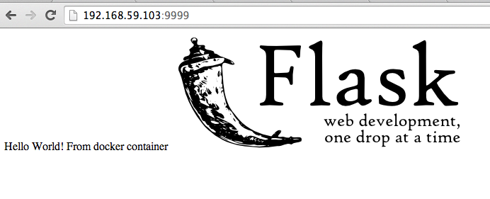
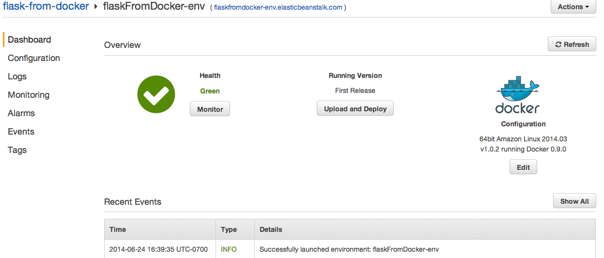

## sample python flask applicationi image

### Quick start: run the container
<pre>docker run -p 9999:80 feifan/flasksample</pre>
Application will start running on `localhost:9999` or `(boot2docker ip):9999`

#### Screen shot:
(boot2docker ip: 192.168.59.103)

### Run on Amazon Elastic Beanstalk
upload `Dockerrun.aws.json` in the project to AWS elastic beanstalk console. It takes about 8~10 minutes to finish the deployment.

